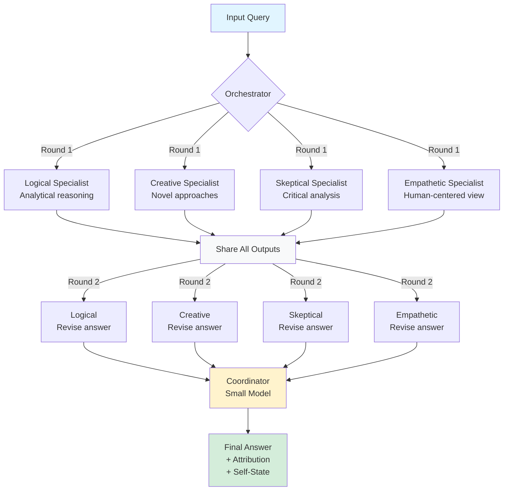
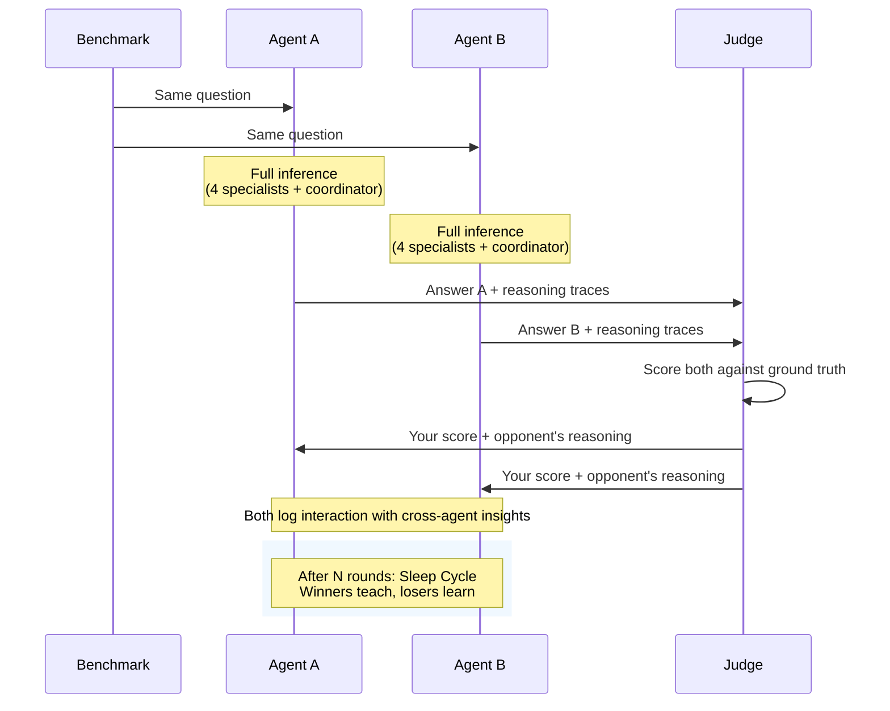
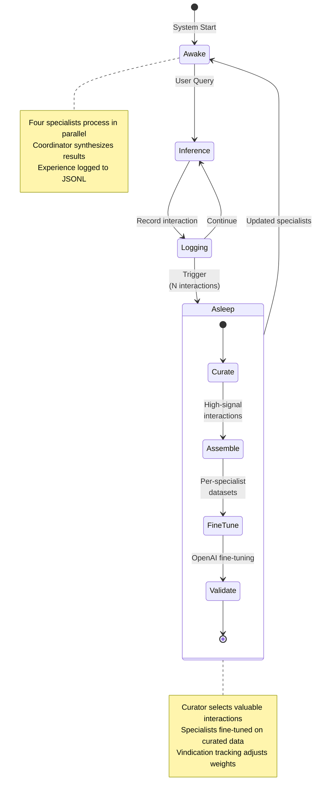

# CogArch — Parallel Cognitive Architecture

<p align="center">
  <a href="LICENSE.md"></a>
  <a href="https://www.python.org/downloads/"></a>
  <a href="https://github.com/info-arnav/CogArch/issues"></a>
  <a href="https://github.com/info-arnav/CogArch/stargazers"></a>
</p>

A Python framework for machine consciousness through parallel specialist LLMs, competitive learning, and sleep-cycle fine-tuning.

**Core concept:** A smaller coordinator model (GPT-4o-mini) learns to orchestrate multiple larger specialist models (GPT-4o), inspired by how the brain's prefrontal cortex coordinates specialized regions.

This project is somewhat vibe-coded and primarily exists to test the concept.

---

## What This Is

CogArch is a research framework where:

- Multiple specialist LLMs run in parallel on every input (logical, creative, skeptical, empathetic)
- Specialists share outputs and engage in a revision pass (consensus deliberation)
- A lightweight coordinator model synthesizes their perspectives with attribution weights
- Continuous improvement through competitive training and sleep-cycle fine-tuning
- Self-state tracking - the system maintains awareness of its own uncertainty, focus, and routing patterns

**Novel contributions:**
- Vindication tracking: deprioritized specialists get credit when they were actually right
- Competitive learning: two agent instances compete on benchmarks and learn from each other's reasoning traces
- Sleep-cycle consolidation: OpenAI fine-tuning of specialists based on curated high-signal interactions
- Self-improvement experiments: automated baseline → train → re-test loop proving the system improves on real benchmarks (GSM8K, MMLU, TruthfulQA)

---

## Current Status

Pre-alpha / Active Development

**Implemented:**
- Phase 1: Full inference pipeline (specialists, coordinator, orchestrator)
- Phase 2: Competitive training (two agents compete on benchmarks)
- Phase 3: Sleep cycle (curator, dataset builder, fine-tuning, sleep report)
- Phase 4: Evaluation (scorer, metrics tracker, benchmark loaders)
- Phase 5: Self-improvement experiment pipeline
  - HuggingFace benchmark loaders (GSM8K, MMLU, TruthfulQA)
  - Train/test splitting with per-cycle unique question partitioning
  - Automated baseline → compete → fine-tune → re-test loop
  - Model swap: specialists auto-updated to fine-tuned versions
- OpenAI fine-tuning integration (file upload, job creation, monitoring)
- OpenAI backend (GPT-4o specialists, GPT-4o-mini coordinator)
- YAML-based specialist + coordinator prompt configs
- Experience logging (JSONL append-only)
- CLI commands: `infer`, `compete`, `sleep`, `dashboard`, `bench`, `experiment`, `finetune-status`

See [CONTRIBUTING.md](CONTRIBUTING.md) for how to help.

---

## Quick Setup

```bash
git clone https://github.com/info-arnav/CogArch.git
cd CogArch
python -m venv venv && source venv/bin/activate
make install-dev

cp .env.example .env
# Add your OPENAI_API_KEY to .env
```

---

## Usage

```bash
# Run inference on a query
python -m cli.main infer "What causes ocean tides?"

# Skip the revision pass (faster, Round 1 only)
python -m cli.main infer "What is 2+2?" --no-revision

# Run a competitive session between two agent instances
python -m cli.main compete data/benchmarks/sample.jsonl --rounds 3

# Run a sleep cycle (curate interactions, build training datasets)
python -m cli.main sleep

# Sleep cycle with OpenAI fine-tuning
python -m cli.main sleep --fine-tune --wait

# Run benchmark evaluation
python -m cli.main bench data/benchmarks/sample.jsonl --metric fuzzy_match

# Run a full self-improvement experiment (downloads from HuggingFace)
python -m cli.main experiment gsm8k --cycles 5 --fine-tune --wait

# Check fine-tuning job status
python -m cli.main finetune-status --cycle 1

# View metrics dashboard
python -m cli.main dashboard
```

---

## Architecture Overview

### Inference Pipeline



### Competitive Learning



### Wake/Sleep Cycle



**Core Components:**
- **Specialists**: Same base model (GPT-4o), different personalities (YAML configs + fine-tuned adapters)
- **Coordinator**: Smaller model (GPT-4o-mini) that routes and synthesizes, doesn't solve directly
- **Experience Log**: JSONL append-only record of all interactions for training
- **Sleep Cycle**: Curate → Assemble → Fine-tune → Validate loop
- **Experiment Runner**: Automated self-improvement loop with real benchmarks from HuggingFace
- **Competitive Training**: Two agents compete, cross-learn from reasoning traces

---

## Design Principles

1. Specialists are configs, not code - adding a new specialist means creating a new YAML file
2. Inference and training fully separated - run inference with zero training dependencies
3. Prompts are first-class citizens - versioned, testable, swappable
4. Every data artifact has a clear home - structured data/ directory with schemas

---

## Requirements

- Python 3.10+
- OpenAI API key (GPT-4o for specialists, GPT-4o-mini for coordinator)
- Approximately $0.01-0.05 per inference depending on input length
- No GPU required - runs entirely via OpenAI API

---

## Documentation

- [Architecture Specification](docs/PARALLEL_COGNITIVE_ARCHITECTURE_SPEC.md) - Complete build document
- [Contributing Guide](CONTRIBUTING.md) - How to contribute
- [Code of Conduct](CODE_OF_CONDUCT.md) - Community standards
- [Changelog](CHANGELOG.md) - Version history

---

## Contributing

We welcome contributions. High-impact areas:

- Core pipeline implementation (Phase 1: inference loop)
- Benchmark integrations (ARC-AGI, FrontierMath, custom tasks)
- Evaluation metrics (routing accuracy, vindication tracking)
- Competitive training loop
- Documentation and examples

See [CONTRIBUTING.md](CONTRIBUTING.md) for setup instructions and development workflow.

---

## License

MIT License - see [LICENSE.md](LICENSE.md) for details.

---

## Acknowledgments

Inspired by:
- Global Workspace Theory (Bernard Baars)
- Attention Schema Theory (Michael Graziano)
- The Wake-Sleep algorithm (Hinton et al.)
- Model-agnostic meta-learning research
- The open source AI community

Built by [Arnav Gupta](https://github.com/info-arnav) • [Report an issue](https://github.com/info-arnav/CogArch/issues)
